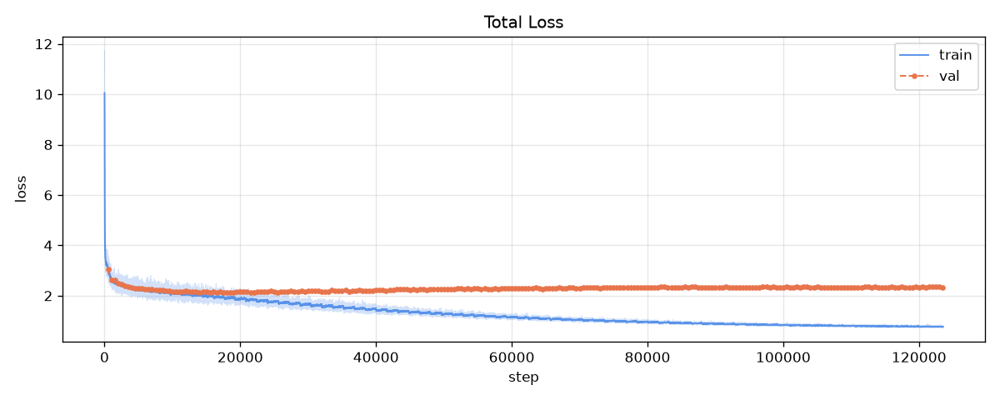
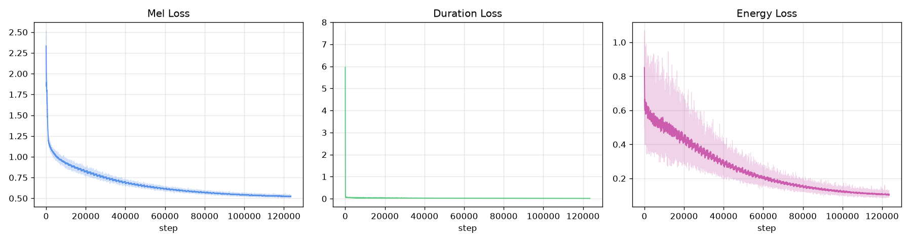
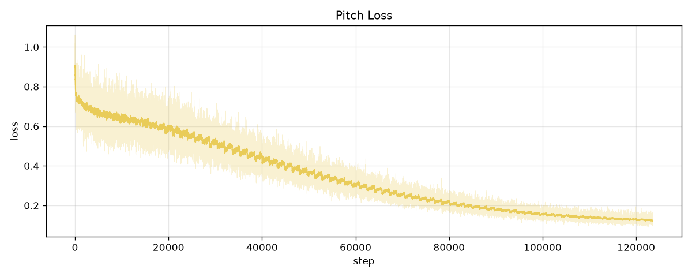
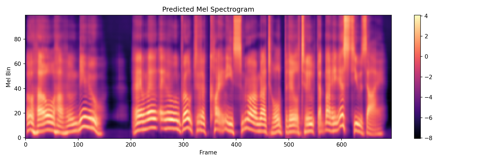

# EvoTalk

A single-speaker text-to-speech acoustic model built from scratch in PyTorch. A standalone architecture that predicts mel spectrograms from phonemes, vocoded natively with Vocos at 24 kHz.

## Status

The current v1 model has overfitted to its training data (Hi-Fi TTS speaker 9017), so generalization to new speakers or unseen prosody is limited. A second version addressing this is in active development. The model does however produce intelligible audio output for single-speaker synthesis.

## Architecture

CosmicFish-like: transformer encoder and decoder (GQA, RoPE, SwiGLU, RMSNorm) around a variance adaptor that predicts per-phoneme duration, pitch, and energy, then expands the enriched sequence to frame level with a length regulator. ~80M parameters.

## Training Data

- Hi-Fi TTS (MikhailT/hifi-tts), speaker 9017 (male), ~53 hours, ~51k utterances.
- Text to ARPABET via espeak, durations via MMS forced alignment.
- Log-magnitude mel (100 bands, f_max 12 kHz) matched exactly to the Vocos vocoder config.
- Continuous pitch contour and per-frame energy extracted on GPU.

## Pipeline

| Stage | Script | Purpose |
| ----- | ------ | ------- |
| Prepare | `prepare.py` | G2P, alignment, feature extraction, dataset + metadata |
| Train | `train.py` | Main training with masked L1/MSE losses, AMP, cosine LR |
| Finetune | `finetune.py` / `long_finetune.py` | Long-form and extra-long utterance stages |
| Synthesize | `inference.py` | Interactive REPL with sentence/clause chunking |
| Predict | `predict.py` | Render the predicted mel spectrogram as an image |
| Sweep | `sweep.py` | Render one script across every checkpoint |

## Usage

```bash
python prepare.py --out_dir data
python train.py --data_dir data
python inference.py
```

Install dependencies with `pip install -r requirements.txt`.

## Graphs

Training curves from `graphs/`.







## Prediction

Predicted mel spectrogram from `python predict.py --text "Hello! How are you? I am EvoTalk a TTS model built by Mistyoz AI." --out mel.png`.



## License

Apache 2.0
